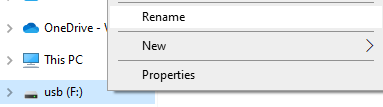

# TorrentBox Setup

## Requirements

* Raspberry Pi
* SD Card
* USB Storage Medium
* Raspberry Pi power supply and cable
* Ethernet cable (optional)

## Initial Setup

Before starting, you need to set up a Raspberry following the instructions [here](https://projects.raspberrypi.org/en/projects/raspberry-pi-setting-up/0).
If you plan on using Wi-Fi, it is a good idea to set the credentials when flashing the SD card, otherwise you will need to connect it to a keyboard and monitor.

Once it is all set up and you have connected via SSH, the next step is to update everything with:

```shell
sudo apt update
sudo apt full-upgrade
```

## mDNS

Raspberry Pis come with mDNS set up (if yours doesn't, [read here](https://archive.is/6HgJY)).
If your Raspberry Pi is named "raspberrypi" (not the same as the user, which is "pi" by default), you can access the Raspberry Pi at `raspberrypi.local`.
In any instances where these instructions mention going to an IP address, you can use `raspberrypi.local` instead.
This means you don't need to set up a static IP address, because the address will be resolved to the Pi's IP address.

I suggest renaming your device to something more meaningful, such as "media".
This means you can access the qBittorrent and Plex servers at `media.local:8080` and `media.local:32400/web`.

## Create Filesystem

Add the following line to the end of your `/etc/fstab` file:

```
LABEL=MEDIA /mnt/mediadrv auto defaults,auto,users,rw,nofail,noatime 0 0
```

This simply mounts a drive called MEDIA to `/mnt/mediadrv`.

In order to set up this drive, you can connect it to either the Raspberry Pi or your PC and do the following steps.

### Connected to Raspberry Pi or Linux PC

If the drive auto-mounts, unmount it with `sudo umount /path/to/device`.
Find your device with `lsblk -f`.
Take note of the device name (probably `sd**`).

Next, you can format it to whatever filesystem you prefer, however, some can only be treated as removable drives.
If it is an internal drive, it cannot be mounted with the appropriate permissions to download content to it.
Both NTFS and EXT4 work, but there may be other options.
NTFS is best if you will ever plug the drive into a Windows device.

#### NTFS

```shell
drive="/dev/sd**"  # replace this
sudo mkfs -t ntfs $drive -Q  # This will delete all files on the drive
sudo ntfslabel $drive MEDIA
```

#### EXT4

```shell
drive="/dev/sd**"  # replace this
sudo mkfs -t ext4 $drive  # This will delete all files on the drive
sudo e2label /dev/sd** MEDIA
```

You should next add the following to you **superuser** crontab.
This can be accessed with `sudo crontab -e`.

```
@reboot /home/pi/TorrentBox/scripts/set_up_drive.sh > /home/pi/TorrentBox/sudo_crontab.log 2>&1
```

This will automatically set the permissions for the drive, if it is mounted.
It will also log information for the latest reboot to `~/TorrentBox/sudo_crontab.log`.

### Connected to Windows PC

Of the _internal_ filesystem formats that Linux supports, NTFS appears to be the only one that Windows also supports.
Make sure you back up the drive, because any data will be deleted.

Insert the USB drive, right click on it in File Explorer, and select "*Format*".
Set the _File system_ to NTFS and the _Volume label_ to "MEDIA".
Selecting _Quick Format_ will make the drive format faster, so it is a good idea to use it.
Press _Start_ and wait for it to finish.


If your drive is already formatted and you just want to change the name, you can right-click on it and select _Rename_.
Change the name to "MEDIA".



In both cases, eject the drive, plug it in to a powered-down Raspberry Pi, and then power on the Pi.

## Cron Jobs

There are a few scripts for being used in cron jobs (or being run manually) in the `scripts/` directory.
These are:

* `clean_junk.py` - Cleans out any junk files (.txt, .nfo, etc.) included with the torrents.
* `remove_empty.sh` - Remove empty directories to tidy up the filesystem.
* `move_to_folders.sh` - Move files in the root media directories to a folder with a matching name.

You can add the following to your crontab (`crontab -e`):

```
# Clean up files at night (3am, staggered by 5 minutes)
0 3 * * * $HOME/TorrentBox/scripts/clean_junk.py
5 3 * * * $HOME/TorrentBox/scripts/remove_empty.sh
10 3 * * * $HOME/TorrentBox/scripts/move_to_folders.sh
```

## Install qBittorrent

We only need the headless version of qBittorrent.
This can be installed with:

```shell
sudo apt install qbittorrent-nox
```

If you want to be able to have the full qBittorrent experience, you can also install it alongside/instead of `qbittorrent-nox` with:

```shell
sudo apt install qbittorrent
```

You can start qBittorrent by running:

```shell
# Default port (8080)
qbittorrent-nox
# Or, with a custom port
qbittorrent-nox --webui-port=<port>
```

You can view the Web UI by accessing the IP address of the Raspberry Pi followed by the port number (default is 8080) in a web broswer.
For example, `192.168.x.x:8080`.

You should configure qBittorrent to launch on boot by adding the following to your crontab (edit crontab with `crontab -e`):

```
@reboot $HOME/TorrentBox/scripts/torrentbox.sh
```

The file `config/qBittorrent.conf` can be copied to `~/.config/qBittorrent/qBittorrent.conf`.
This contains some configuration settings that may be useful.
More importantly, it sets up the TV and Movies categories and their installation directory.
Without doing this, everything would save to the SD card instead.

If you choose to do this in the web UI, rather than copying the configuration file, simply right click under the "CATEGORIES" header in the sidebar and select "Add category...".
You should create two categories, one called "TV" located at `/mnt/mediadrv/TV`, and one called "Movies" located at `/mnt/mediadrv/Movies`.

## Plex

To add the Plex repository in Debian, run the following commands:

```shell
# All commands need sudo. Consider running `sudo -v` before pasting
echo deb https://downloads.plex.tv/repo/deb public main | sudo tee /etc/apt/sources.list.d/plexmediaserver.list
curl https://downloads.plex.tv/plex-keys/PlexSign.key | sudo apt-key add -
sudo apt update
```

After that, it can be installed with:

```shell
sudo apt install plexmediaserver
```

You can then launch Plex using:

```shell
sudo systemctl start plexmediaserver
```

and access it at `192.168.x.x:32400/web`.

Once you're connected, follow [these instructions](https://support.plex.tv/articles/200288896-basic-setup-wizard/) to get set up.
Make sure you use `/mnt/mediadrv/TV` for the TV show library, and `/mnt/mediadrv/Movies` for the movie library.

