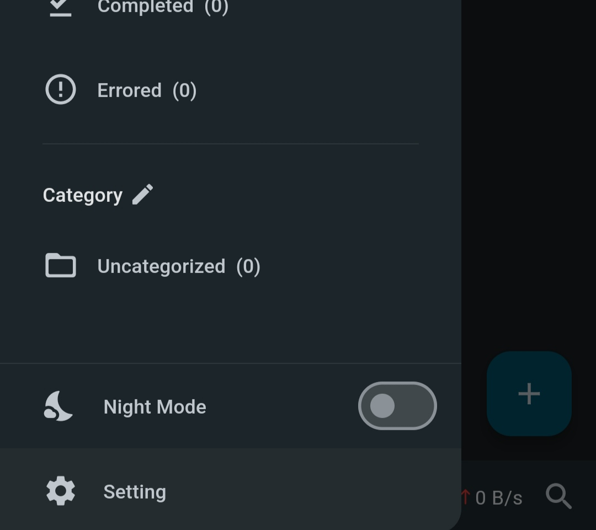
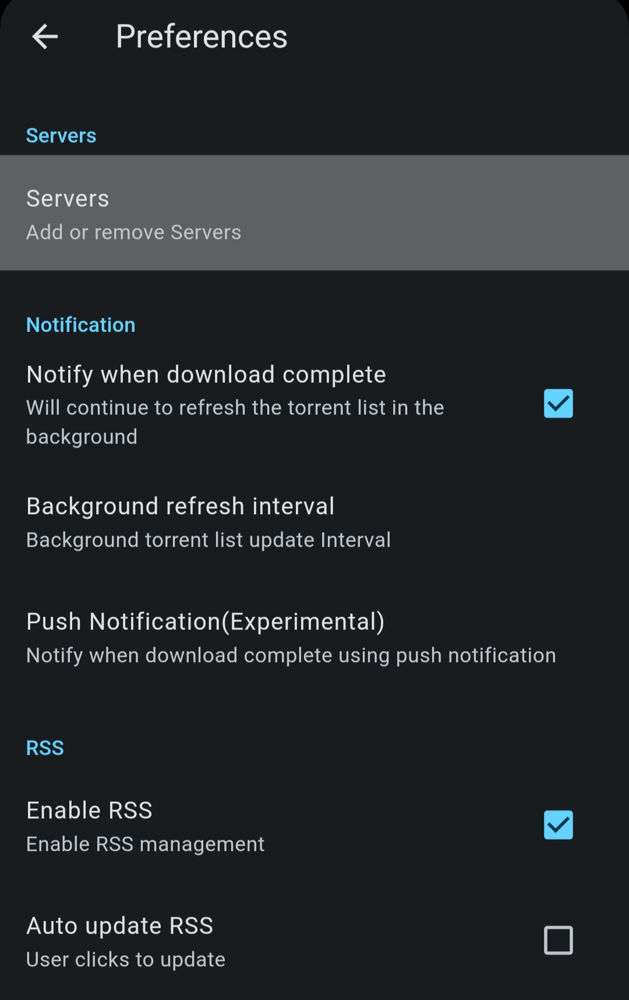
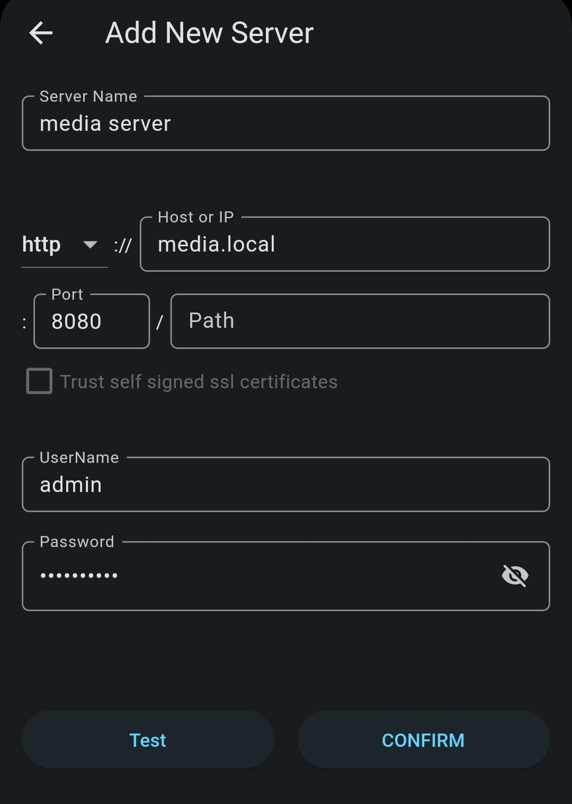
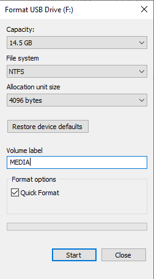

# User Guide

These instructions are intended for anyone with a torrent box that has already been set up, but wants to make some changes.
This will assume you are running Windows on your PC.
It will also assume the device can be accessed at `media.local`.
If this is not true, replace `media.local` with the known IP address, or refer to the [mDNS section](#mdns-not-working)

## Android Client Setup

Download the following apps:

* [qBittorrent Remote Lite](https://play.google.com/store/apps/details?id=me.fengmlo.qbRemoteFree)
* [Plex: Stream Movies & TV](https://play.google.com/store/apps/details?id=com.plexapp.android)

_Plex is available on iOS, however, torrenting apps are not permitted by Apple, so qBittorrent must be accessed in a web browser (or an app must be sideloaded)._

Plex is easy to set up.
Simply create an account/sign in and set up the app how you like.

qBittorrent involves a bit more set up.
When you open the app, add a new server.
This can be done by tapping the button in the center or by opening the sidebar and selecting _Setting_ and then _Servers_.

Once there, enter the following details:

* **Server Name**: your choice
* **Host or IP**: `media.local` (or the IP address if that doesn't work)
* **Port**: `8080`
* **UserName**: `admin` (unless changed)
* **Password**: `adminadmin` (unless changed)

## PC Client Setup

Download Plex Desktop from your operating system's store, or from [this page](https://www.plex.tv/media-server-downloads/?cat=plex+desktop#plex-app).

Once installed, create an account/sign in.
Plex will automatically detect your server.

<!-- TODO what about qbittorrent and plex config (web UIs) -->

## mDNS not working

## Changing Drive

If you've exceeded the space on the drive, first consider whether you want to delete some media.
This can be done in Plex by tapping the 3 dots on the media and selecting _Delete_.

If you don't want to delete the content, or just want to set up a higher capacity drive, do the following:

1. Insert your new drive into a computer to format it.
1. Right-click on the drive in File Explorer and select _Format..._.
1. Set the file system to NTFS and the volume label to "_MEDIA_".

1. Click _Start_ and wait for the drive to be formatted.
1. Once the drive is formatted and the Raspberry Pi isn't downloading or playing media, power down the Raspberry Pi, remove the old drive, insert the new drive, and power on the Raspberry Pi.
1. Wait up to a minute for the Raspberry Pi to boot up. You will know it is powered if the red LED on the Raspberry Pi is illuminated.

QBittorrent will automatically shut down and will not be accessible if the drive is not configured properly.
If this happens, try to format the drive again.

It is important that you do not connect two drives named "_MEDIA_" at the same time.
Either only one or none of them will work.

## Changing Wi-Fi Credentials

If you've changed your Wi-Fi SSID or password, you may need to update the credentials for the Raspberry Pi so it can reconnect.
In general, it would be better to connect directly to the router via Ethernet as it is faster and doesn't require any configuration; but these instructions will explain how to make the necessary changes for Wi-Fi.

## Changing IP Address

If you're not using mDNS, or it's not working, you'll need to be aware of your IP address.
Since the IP address is dynamically allocated, it'll have to be set to a static IP address so it doesn't unexpectedly change.

The easiest way to do this if you aren't tech-savvy is to connect the Raspberry Pi to a monitor and keyboard to get the desktop experience.

If you'd rather not make the IP address static, you can get the dynamic IP address with `hostname -I` in the terminal.
If it is different to what your qBittorrent app is configured to use, it will need to be updated in the app.
Plex will automatically find the server.

But, if you _do_ want to make the IP address static, you can follow [these instructions](https://archive.is/usniZ#using-the-raspberry-pi-os-guide-to-set-a-static-ip-3).
It includes both instructions for using the command line or the GUI to make the IP address static.

In general, it is also a good idea (but optional) to make the router recognise that the IP address is static, or to create a block of static IP addresses that it cannot accidentally allocate to.
The method to do this will vary between routers, so you'll need to look up instructions for your router.

One major downside of the static IP address is that if you change your router, the subnet of the local network may change (i.e. your IP addresses might change from `192.168.0.x` to `182.168.1.x`).
The static IP address will not automatically update, so this will need to be done manually again by following the steps above.

<!-- also talk about setting static IP address -->